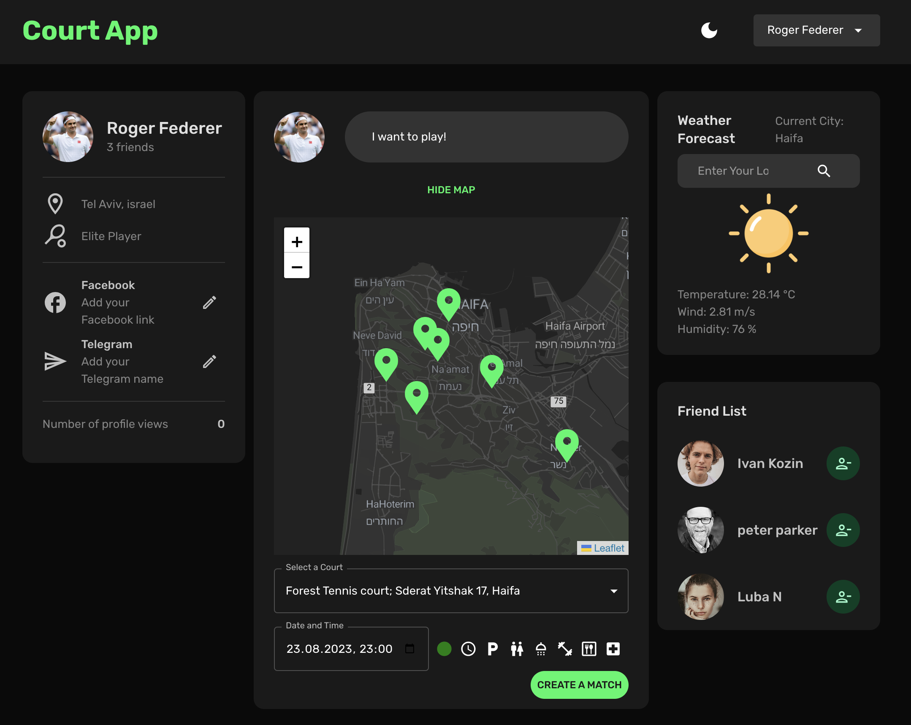
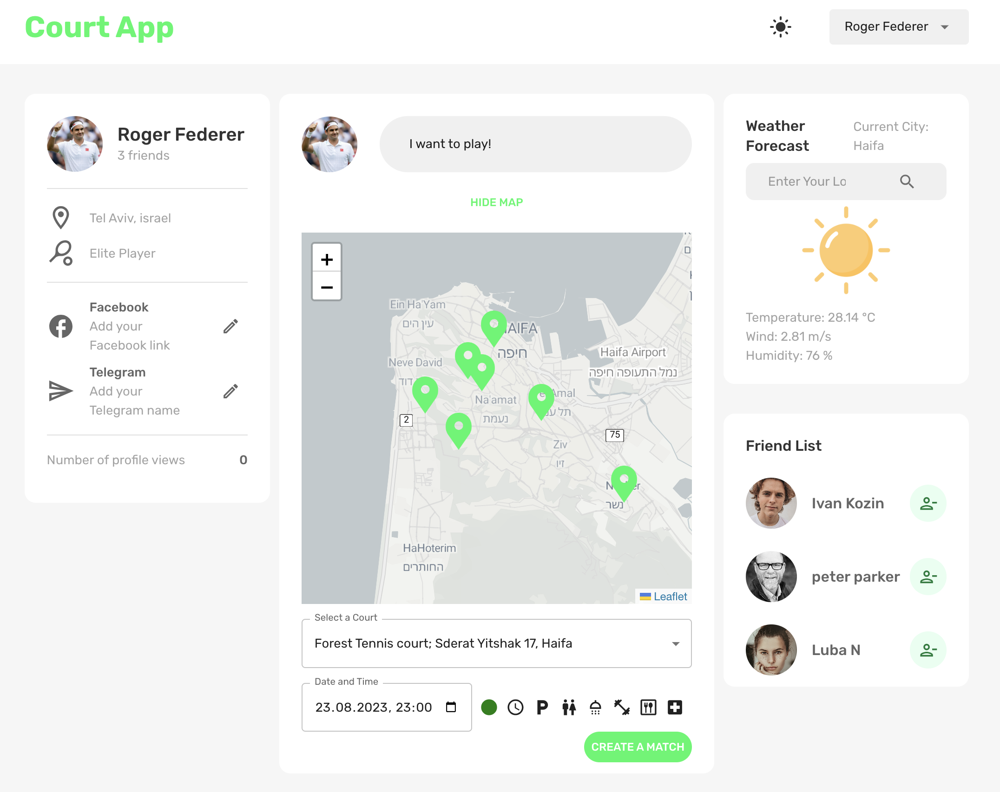

# Court App

Welcome to the Court App! This is a social media platform designed to solve the challenges faced by tennis enthusiasts when it comes to finding partners and courts to play on. The app provides a comprehensive solution with features that empower users to connect, share, and engage with fellow players.

## The Problem

Tennis enthusiasts often struggle with the following problems:

- **Finding Tennis Partners:** Locating players of similar skill levels and availability for a match can be challenging, leading to missed opportunities for enjoyable gameplay.

- **Discovering Suitable Tennis Courts:** Identifying nearby tennis courts with the right facilities, surfaces, and working hours can be time-consuming and frustrating.

## Features & Solutions

- **User Registration and Authentication:** Users can create accounts, log in, and access their profiles, enabling seamless connections with other players.

- **Tennis Court Information:** Explore detailed information about different tennis courts, including location, facilities, and working hours. Say goodbye to uncertainty about court features.

- **Match Scheduling:** Easily schedule matches with other users based on court availability, ensuring you find partners who fit your playing schedule.

- **Weather Forecast:** Stay informed about the weather conditions in your area for optimal match planning. No more last-minute weather surprises.

- **Dark/Light Mode:** Customize the app's appearance with dark or light mode themes, enhancing the user experience based on personal preference.

## Installation and Setup

1. Clone the repository to your local machine:

- git clone https://github.com/ilyanosovsky/court-app.git

2. Navigate to the project directory:

- cd court-app

3. Install project dependencies:

- npm install

4. Create a `.env` file in the root directory and set the necessary environment variables:

- REACT_APP_BASE_URL=https://api.example.com
- REACT_APP_WEATHER_API_KEY=your-weather-api-key

API_key you can find after your registration on https://openweathermap.org/

5. Start the development server:

- npm start

6. Open your browser and access the app at `http://localhost:3000`.

## Technologies Used

- React https://react.dev/
- Redux Toolkit (for state management) https://redux-toolkit.js.org/
- Material-UI (for UI components) https://mui.com/
- Formik and Yup (for form handling and validation) https://www.npmjs.com/package/formik https://www.npmjs.com/package/yup
- MongoDB for DataBase https://www.mongodb.com/
- React Router (for routing)
- Fetch API (for data fetching)
- OpenWeather API (for weather forecasts) https://openweathermap.org/
- Leaflet React (for Map handling) https://react-leaflet.js.org/
- Render (for deployment web service live) https://render.com/

## Contributing

Contributions are welcome! If you find any issues or have suggestions for improvements, please feel free to open an issue or submit a pull request.

---

Feel free to reach out if you have any questions or need assistance. Enjoy using the Court App!
